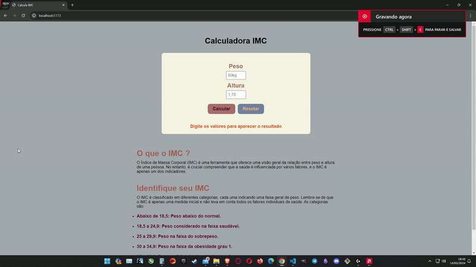

  

# Projeto Calculadora IMC com React - ⚖️

Projeto foi uma lição de casa do framework React, do curso Engenheiro Front End (Ebac). Utilizei o Vite para compilar e React como framework de JavaScript e CSS para estilização.

# Tecnologias - 👨‍💻

- Vite
- React
- JavaScript
- CSS
- Git e Github
